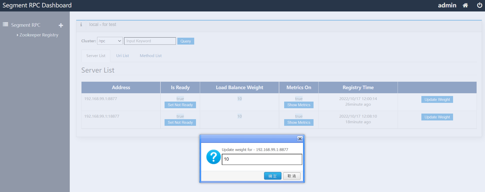

# segment-rpc
A Java simple RPC framework based on netty writen in Groovy. Use routers instead of method invoke.

## features
> 1. registry support local and zookeeper
> 2. load balance
> 3. metrics
> 4. spring context support

## todos
> 1. ~~dashboard~~ / management

## Echo Client-Server Demo


### change conf.properties
zookeeper.connect.string=192.168.99.100:2181

### EchoServer.groovy
```groovy
package org.segment.rpc.demo

import org.segment.rpc.server.RpcServer
import org.segment.rpc.server.handler.ChainHandler
import org.segment.rpc.server.handler.Resp
import org.segment.rpc.server.provider.DefaultProvider

def server = new RpcServer()

def h = ChainHandler.instance
h.context('/rpc').group('/v1') {
    h.get('/echo') { req ->
        println req.body
        Resp.one('ok - ' + req.body)
    }
}

DefaultProvider.instance.provide(SayInterface.class, new SayImpl())

server.start()
```

### EchoClient.groovy
```groovy
package org.segment.rpc.demo

import org.segment.rpc.client.RpcClient
import org.segment.rpc.invoke.ProxyCreator
import org.segment.rpc.server.handler.Req

def client = new RpcClient()

// test method invoke
SayInterface say = new ProxyCreator(client, '/rpc').create(SayInterface)
println say.hi('kerry')
// simple call
def resp = client.sendSync(new Req('/rpc/v1/echo', "hi kerry".toString()))
println '' + resp.status + ':' + resp?.body

int threadNumber = 10
int loopTimes = 10
threadNumber.times { i ->
    Thread.start {
        loopTimes.times { j ->
            def resp2 = client.sendSync(new Req('/rpc/v1/echo', "hi ${i}, ${j}".toString()))
            println '' + resp2.status + ':' + resp2?.body
            println say.hi("kerry ${i}, ${j}".toString())
            // mock do business
            long ms = 10 + new Random().nextInt(10)
            Thread.sleep(ms)
        }
    }
}
```

### beans.groovy (spring bean define)
```groovy
import org.segment.rpc.client.RpcClient

beans {
    xmlns rpc: 'https://github.com/segment11/segment-rpc/tree/main/schema/segment-rpc'
    rpc.'segment-rpc-provider'('base-package': 'com.segment.rpc.spring')

    // it will create a bean named beanRemote
    rpc.'segment-rpc-caller'(interface: 'com.segment.rpc.spring.Bean', client: 'client', context: '/rpc')

    client(RpcClient) {
        it.destroyMethod = 'stop'
    }
}
```

### TestBeanLoad.groovy
```groovy
package com.segment.rpc.spring

import org.segment.rpc.server.provider.DefaultProvider
import org.springframework.context.support.GenericGroovyApplicationContext
import spock.lang.Specification

class TestBeanLoad extends Specification {

    def testAll() {
        given:
        def context = new GenericGroovyApplicationContext()
        context.load('classpath*:beans.groovy')
        context.refresh()
        and:
        def metaList = DefaultProvider.instance.listMethodsByInterface(Bean.class)
        println metaList
        def bean = context.getBean('beanImpl')
        def beanRemote = context.getBean('beanRemote')
        println beanRemote
        expect:
        metaList.size() == 1
        bean != null
        bean == DefaultProvider.instance.lookupMethod(metaList[0]).target
        cleanup:
        context.close()
    }
}
```

## dashboard overview: 
 